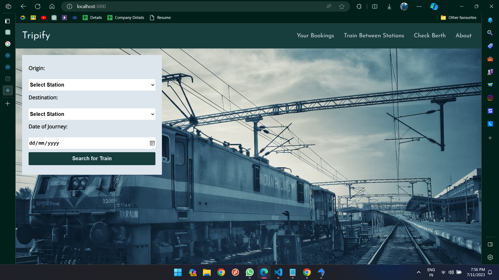
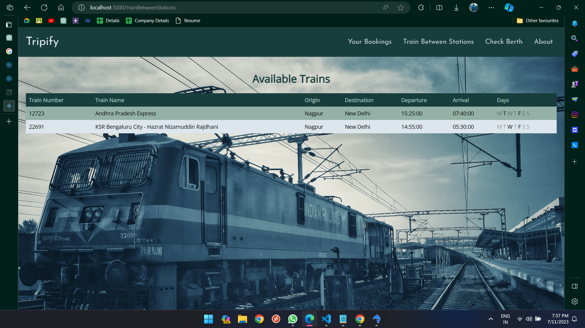
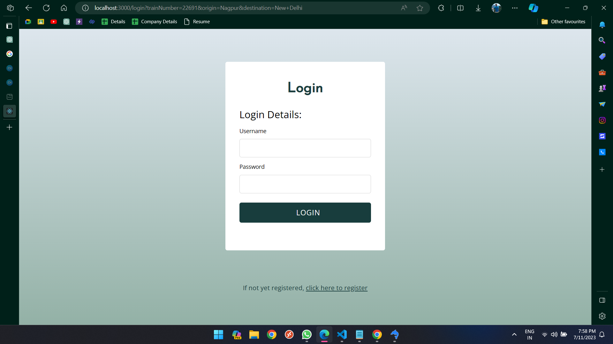

# VistaRail - Train Booking System

VistaRail is a web application built using HTML, CSS, JavaScript, Node.js, and MySQL. It serves as a demonstration of a train booking system, offering features such as OTP verification, authentication, login/signup, PNR checking, and ticket cancellation.





## Features

- User authentication and authorization system
- OTP verification for secure user registration
- Login and signup functionality
- PNR checking to track the status of booked tickets
- Ticket cancellation option for users
- MySQL database integration for storing user and booking information

## Database Setup

To set up the MySQL database for VistaRail, follow these steps:

1. Import the provided `.sql` file located in the `database` directory into your MySQL server.

## Installation

To run VistaRail locally, follow these steps:

1. Clone the repository:

```bash
git clone https://github.com/rht-21/VistaRail.git
```

2. Navigate to the project directory:

```bash
cd vistarail
```

2.Install dependencies:

```bash
npm install
```

4. Start the application:

```bash
npm start
```

Open your web browser and visit http://localhost:3000 to access VistaRail.

5. Usage

- Sign up for a new account or log in if you already have one.
- Use the provided OTP verification for secure registration.
- Book train tickets by selecting your desired journey details.
- Check the status of booked tickets using the PNR checking feature.
- Cancel booked tickets if needed.
